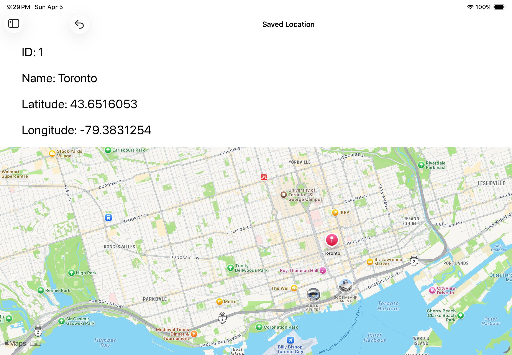
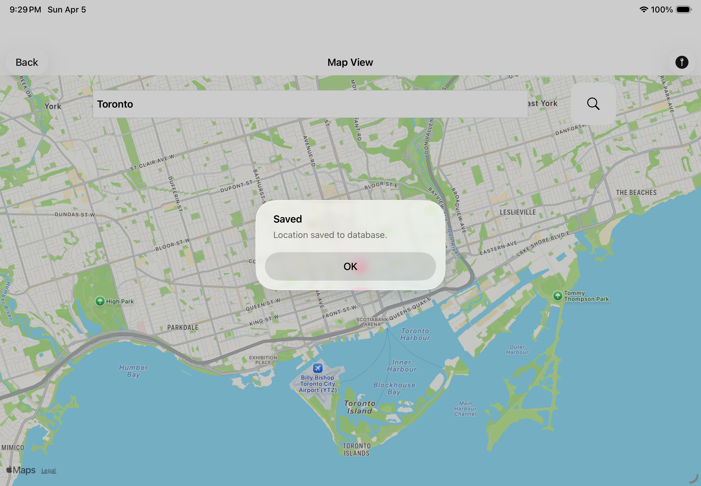
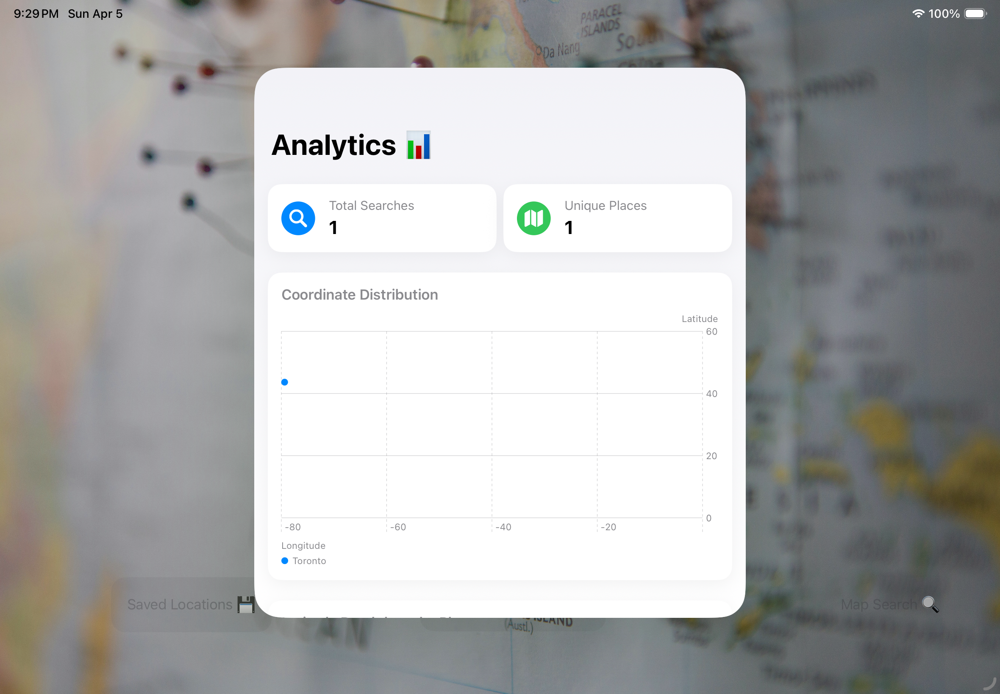

## Project Overview
This iOS app is developed as part of the practical exam for PROG31632. The app features:

- **SQLite Database:** Stores and retrieves information. (40% of marks)  
- **Search Map Feature:** Allows users to search locations. (20% of marks)  
- **Split View:** Provides a split-screen interface for better navigation. (40% of marks)  

The app design is open, allowing for creative UI and UX choices.

## App Screenshots

**Main Screen**


**Split View**


**Map Search**


**Analytics Screen**


---

## Installation
1. Clone the repository:
```bash
git clone [[https://github.com/JanasiRajput/IOS-LocationApp.git]]


